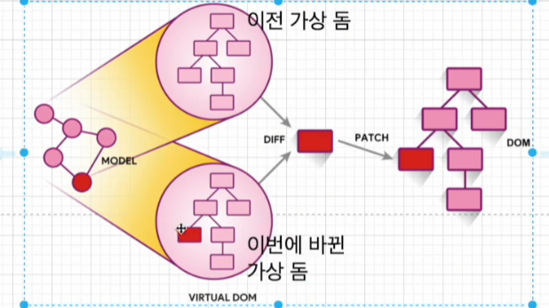

# [ 0318 ] TIL

---

### 목차

1. [리액트](#-서론)

---


## 1. 리액트

---

# 리액트

---


- 리액트 컴포넌트는 크게 2가지 형식으로 구성이 된다.

```javascript
# 클래스 컴포넌트
class App extends Component{
    render(){
        return <h1>안녕하세요.</h1>;
    }
}

#  함수형 컴포넌트
function App(){
    return <h1>안녕하세요.</h1>
}

```

- 기존에는 클래스 컴포넌트를 많이 사용했지만 리액트 hook이 나오고 함수형 컴포넌트 선호


### 가상돔

- 리액트는 가상돔을 사용한다.

### 브라우저 렌더링 과정 (crp)
- 브라우저가 서버에서 페이지에 대한 html 응답을 받고 화면에 표시하기 전에 여러 단계가 있는데 1. 웹 브라우저가 html 문서를 읽고 스타일 입히고 뷰포트에 표시하는 과정

1. 돔 트리 형성
- 렌더 엔진이 문서를 읽어들이고 그것들을 파싱하고 어떤 내용을 페이지에 렌더링을 할 것인지 판단한다.

2. Render tree 생성
- 이 단계에서는 브라우저가 dom과 cssom을 결합하는 곳이며 이 프로세스는 화면에 보이는 모든 컨텐츠와 스타일 정보 모두 포함하는 최종 렌더링 트리를 출력한다.

3. layout
- 이 단계는 브라우저가 페이지에 표시되는 각 요소의 크기와 위치를 계산하는 단계이다.

4. paint
- 실제 화면에 그리기

### 문제점
- 어떤 인터렉션에 의해서 dom의 변화가 발생하면 그 때 마다 render tree가 재생성되어서 모든 스타일 다시 계산,  layout, repaint 과정을 가치게 된다.

- 만약에 인터렉션이 많다면 많은 비용을 지불하게 된다. 그러니 불필요하게 dom을 조작하는 비용을 줄이기 위해서 가삼 돔을 사용한다.

- 가상 돔이란 실제 dom을 메모리에 복사해준 것


> Dom이란 Document Object Model의 약자로 문서 객체 모델을 의미한다. 이때 문서 객체는 html, head,body와 같은 태그들을 js가 이용할 수 있는 객체를 의미한다.
이때 div, input, a 등이 dom에 해당한다.

### 가상 돔
- 가상 돔은 실제 dom을 메모리에 복사하는 것

### 가상 돔 동작 방식


- 가상 돔이 2개가 있다. 이때 이전의 가상 돔을 도미라고 부르며 이번에 바뀐 돔에서 도미와 비교하여 바뀐 부분만 실제 돔에 적용하는 방식을 가진다.
- 바뀐 부분을 찾는 과정을 `Diffing`이라고 부른다. 바뀐 부분만 실제 돔에 적용시켜주는 것을 재조정(reconciliation)이라고 부른다.