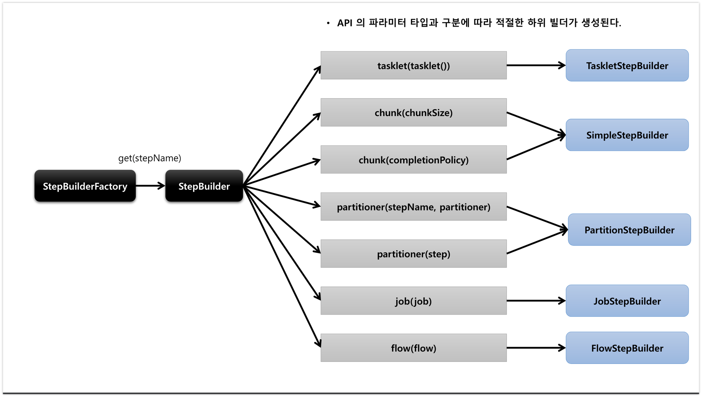
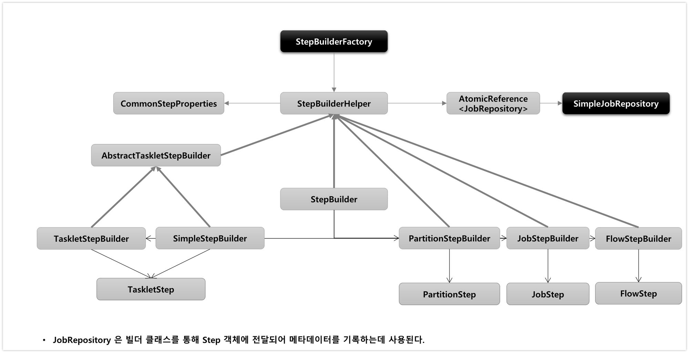

# [ 0612 ] TIL

--- 

- [x] [CS 네트워크]
- [x] [CSS GRID]
- [x] [Spring Batch Step]

---

## [cs네트워크]() 

### 1. 유니캐스트

---

- 1:1 통신을 의미한다.
  - 대표적으로 HTTP 통신
  - 가장 일반적으로 네트워크 전송 형태

### 2. 멀티캐스트

- 1:N 통신을 의미한다.
  - N이지만 모든 노드 말고 특정 노드에게만 전달

### 3. 브로드캐스트

- 1:N통신
  - 그룹이 아닌 연결되어 있는 모든 노드에게 데이터 전달
    - APR가 대표적인 예시

---

# 네트워크 분류

- 일반적으로 LAN, MAN, WAN이 있으며 LAN이 가장 작은 단위, WAN이 가장 큰 단위이며 보통은 반경, 속도의 크기를 기반으로 분류한다.

### 1. LAN (local area network)

- 근거리 통신망
  - 높은 안전성, 속도를 가진다. ( 소규모 네트워크 )
  - 보통 허브나 스위치로 연결된다.


<aside>
💡 하나의 논리적 IP 기반으로 여러개의 물리적인 주소  MAC으로 구별하는 네트워크

</aside>

- MAC 주소 ( 물리적인 주소 ) - 핸드폰이 제작될 때 생성되는 변하지 않는 주소
- IP 주소 ( 논리적 주소 )


- IP는 ip4, ip6가 있다. 아직까지 ip4를 많이 사용한다.
  - 단점으로는 ip가 부족하다. 이것을 해결하기 위해서 `NAT장치를 통해서` 하나의 IP를 가지고 `가상의 IP`를 부여한다.
  - 즉. 하나의 IP를 부여받지만 각 장치마다 있는 MAC주소로 구별한다. > 만약에 인터넷 통신이 있으면 하나의 IP로 통신한다.

## 2. MAN (metropolitan area network)

- 대도시 통신망, 도시와 도시의 통신망을 뜻하며 2개 이상의 LAN이 연결
- 라우터, 브리지 등으로 연결됨


## 3. WAN ( wide area network ) - internet

- 광역 통신망으로 국가와 국가의 통신망을 의미한다.

# TCP

---

### 정의

- TCP / IP 4계층은 장치들이 인터넷 상에서 데이터를 주고받을 때 쓰는 독립적인 프로토콜의 집합


**애플리케이션 계층**

HTTP,SMTP,SSH,FTP가 대표적인 예시, 실질적으로 사람들에게 제공하는 계층

**전송 계층 - 오류체크**

TCP, UDP가 대표적,  애플리케이션계층에서 받은 메시지를 기반으로 세그먼트 또는
데이터그램으로 데이터를 쪼개고 데이터가 오류없이 순서대로 전달되도록 도움을 주는
층입니다.

**인터넷 계층(network) - 주소**

IP, ICMP, ARP가 대표적이며 한 노드에서 다른 노드로 전송 계층에서 받은 세그먼트 또는
데이터그램을 패킷화 하여 목적지로 전송하는 역할을 담당합니다.

**링크 계층(link)**
링크 계층은 전선, 광섬유, 무선 등으로 데이터가 네트워크를 통해 물리적으로 전송되는
방식을 정의합니다. 데이터링크계층과 물리계층을 합친 계층입니다.

**캡슐화와 비캡슐화**
네트워크에서 캡슐화(encapsulation)란 송신자가 수신자에게 데이터를 보낼 때 데이터가 각
계층을 지나며 각 계층의 특징들이 담긴 헤더들이 붙여지는 과정을 의미합니다.
예를 들어 전송계층은 TCP 헤더, 네트워크 계층은 IP 주소 헤더를 추가하는 것이죠.
비캡슐화(decapsulation)란 이 과정의 역과정입니다. 수신자측에서는 이렇게 캡슐화된
데이터를 역순으로 제거하면서 응용계층까지 도달하는 것을 말합니다.

- 각 계층마다 헤더가 추가되면서 역활을 정의한다.


## PDU

- 각 계층에서 사용되는 데이터 단위를 의미한다.
  - 애플리케이션 계층: 메시지
    ● 전송 계층: 세그먼트(TCP), 데이터그램(UDP)
    ● 인터넷 계층: 패킷
    ● 링크 계층: 프레임(데이터 링크 계층), 비트(물리 계층)

**세그먼트** : 적절한 크기로 쪼갠 조각 (세그먼트와 데이터그램의 의미는 같습니다.)
**패킷** : 세그먼트에 SP와 DP가 포함된 IP 헤더가 붙은 형태의 조각
**프레임** : MAC주소 헤더와 CRC/체크섬 트레일러가 붙은 조각


IPv4 기준의 헤더

- SIP : 송신자 IP 주소
- DP : 수신자 IP 주소

### 프레임


CRC/체크섬 트레일러
데이터의 오류감지를 위한 수학적 함수가 적용된 값들이 있는 필드. 링크의 오류(과도한
트래픽 등) 로 인해 데이터 손상을 감지하는 역할을 합니다. 이 과정에서 CRC와 체크섬
두가지의 과정을 기반으로 데이터 전송오류 및 데이터무결성을 방지하게 됩니다. (둘 다
비슷합니다.)

- CRC : CRC-1, CRC-16 등의 알고리즘으로 나온 값을 통해 데이터 전송오류감지를
  수행합니다.
- 체크섬 : MD5, SHA-256 등의 알고리즘으로 나온 값을 통해 데이터 무결성을
  방지합니다.

## [CSS GRID]() 
### flex는 1차원 구조


### GRID는 2차원적 구조를 가진다.


### grip-template-rows

- grid의 행의 개수 및 크기를 지정할 수 있다.

```java
grid-template-rows: 1fr 2fr 200px
```


```java
  <style>
    * {
      box-sizing: border-box;
    }

    .container {
      border: 1px solid red;
      display: grid;
      grid-template-columns: repeat(2, 1fr 2fr);
      grid-template-rows: repeat(4, 100px);

      /*
      각각의 아이템들 사이의 간격을 설정
      */
      grid-gap: 10px;
    }

    .item {
      border: 1px solid blue;
    }
  </style>
</head>
<body>

<div class="container">
  <div class="item item1">
    item1
  </div>
  <div class="item item2">
    item2
  </div>
  <div class="item item3">
    item3
  </div>
  <div class="item item4">
    item4
  </div>
  <div class="item item5">
    item5
  </div>
  <div class="item item6">
    item6
  </div>
  <div class="item item7">
    item7
  </div>
  <div class="item item8">
    item8
  </div>
</div>

</body>
```

### fr

- 분수를 의미하며 해양 영역을 나눈다.


### grid-column/ grid-row

- grid-column은 grid-line의 번호
- grid-row는 grid-number의 번호를 기준으로 영역을 할당한다.

## [Spring Batch Step]() 

### StepBuilder

- Step을 구성하는 설정 조건에 따라 다섯 개의 하위 빌더 클래스를 생성하고 실제 Step 생성을 위임한다.

| TaskletStepBuilder | TaskletStep을 생성하는 기본 빌더 클래스 |
| --- | --- |
| SimpleStepBuilder | TaskletStep을 생성하며 내부적으로 청크기반의 작업을 처리하는 ChinkOrientedTasklet 클래스를 생성한다. |
| PartitionStepBuilder | PartitionStep을 생성하며 멀티 스레드 방식으로 Job을 실행한다. |
| JobStepBuilder | JobStep을 생성하여 Step안에서 Job을 실행한다. |
| FlowStepBuilder | FlowStep을 생성하여 Step안에서 Flow를 실행한다. |


- SimpleStepBuilder 클래스를 생성해서 결국에는 TaskletStep을 동일하게 생성한다.



- BuilderHelper
- JobRepository는 결국네 Step 객체로 전달
  - 전달을 통해서 메타데이터를 기록한다.



## TaskletStep

### 정의

- Step의 구현체로 Tasklet을 실행시키는 도메인 객체
- RepeatTemplate을 사용하여 Tasklet 구문을 트랜잭션 경계 내에서 반복해서 실행함
- Task 기반과 Chink 기반으로 나누어 Tasklet을 실행함


### 결국에는 StepBuilder가 하위 api를 판단하여 각각의 올바른 Builder를 생성한다.
```java
package com.project.springbatch.step4;//package com.project.springbatch.step3;

import org.springframework.batch.core.BatchStatus;
import org.springframework.batch.core.ExitStatus;
import org.springframework.batch.core.Job;
import org.springframework.batch.core.Step;
import org.springframework.batch.core.job.builder.FlowBuilder;
import org.springframework.batch.core.job.builder.JobBuilder;
import org.springframework.batch.core.job.flow.Flow;
import org.springframework.batch.core.launch.support.RunIdIncrementer;
import org.springframework.batch.core.repository.JobRepository;
import org.springframework.batch.core.step.builder.FlowStepBuilder;
import org.springframework.batch.core.step.builder.StepBuilder;
import org.springframework.batch.item.*;
import org.springframework.batch.repeat.RepeatStatus;
import org.springframework.context.annotation.Bean;
import org.springframework.context.annotation.Configuration;
import org.springframework.stereotype.Component;
import org.springframework.transaction.PlatformTransactionManager;


/**
 * StepBuilder는 하위 api를 판별하여 각각마다 올바른 Builder를 생성한다.
 */
@Configuration
@Component
public class Step4_1 {

    @Bean
    Job job(JobRepository jobRepository, Step step1, Step step2, Step step3) {
        return new JobBuilder("batchJob", jobRepository)
                .incrementer(new RunIdIncrementer())
                .start(step1)
                .next(step2)
                .next(step3)
                .build();
    }

    /**
     *  TaskletStep
     *
     */
    @Bean
    Step step1(JobRepository jobRepository, PlatformTransactionManager transactionManager) {
        return new StepBuilder("step1", jobRepository)
                .tasklet((contribution, chunkContext) -> {
                    System.out.println("step1 was excuted!");
                    return RepeatStatus.FINISHED;
                }, transactionManager)
                .build();
    }


    //SimpleStepBuilder > TaskletStep
    @Bean
    Step step2(JobRepository jobRepository, PlatformTransactionManager transactionManager) {
        return new StepBuilder("step2", jobRepository)
                .<String, String>chunk(3, transactionManager)
                .reader(new ItemReader<String>() {
                    @Override
                    public String read() throws Exception, UnexpectedInputException, ParseException, NonTransientResourceException {
                        System.out.println("11");
                        return null;
                    }
                }).processor(new ItemProcessor<String, String>() {
                    @Override
                    public String process(String item) throws Exception {
                        return null;
                    }
                }).writer(new ItemWriter<String>() {
                    @Override
                    public void write(Chunk<? extends String> chunk) throws Exception {

                    }
                })
                .build();
    }


    //PartitionStepBuilder > partitionStepBuild
    @Bean
    public Step step3(JobRepository jobRepository, PlatformTransactionManager transactionManager) {
        return new StepBuilder("step3", jobRepository)
                .partitioner(step1(jobRepository, transactionManager))
                .gridSize(2)
                .build();
    }

    // job api > jobStepBuilder > JobStep
    @Bean
    public Step step4(JobRepository jobRepository, PlatformTransactionManager transactionManager) {
        return new StepBuilder("step4", jobRepository)
                .job(job(jobRepository, step1(jobRepository, transactionManager), step2(jobRepository, transactionManager),step3(jobRepository, transactionManager)))
                .build();
    }

    // flow api > FlowStepBuilder > FlowStep
    @Bean
    public Step step5(JobRepository jobRepository, PlatformTransactionManager transactionManager) {
        return new StepBuilder("step5", jobRepository)
                .flow(flow(jobRepository, transactionManager))
                .build();
    }

    @Bean
    Flow flow(JobRepository jobRepository, PlatformTransactionManager transactionManager){
        FlowBuilder<Flow> flowBuilder = new FlowBuilder<>("flow");
        flowBuilder.start(step2(jobRepository, transactionManager))
                .end();
        return flowBuilder.build();
    }
}

```