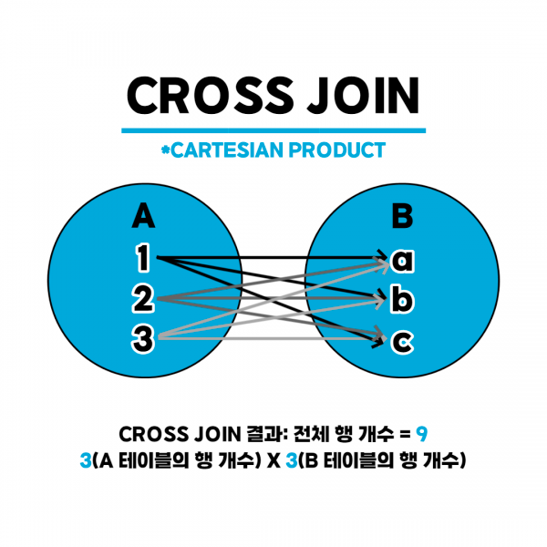
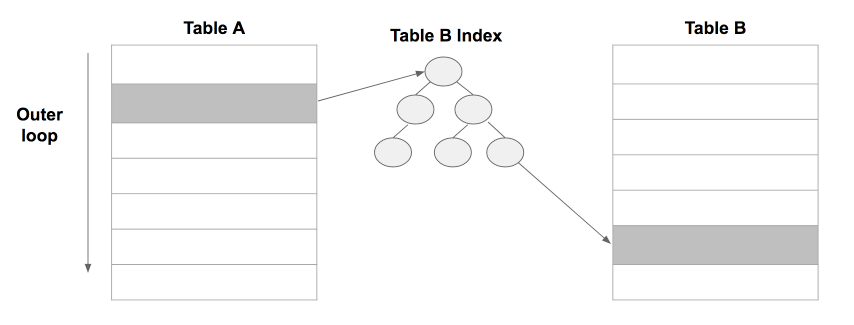

# 6장 결합

---

# 정리
```
1. mysql의 조인 알고리즘은 nested loop만 지원한 .
2. nested loop에서 가장 중요한 부분은 Row가 적은 Driving Table + Inner Table의 조인키에는 인덱스

```


## 기능적 관점으로 구분하는 결합의 종류


### 1. 크로스 결합
- 크로스 조인은 실무에서 사용하는 경우는 겨의 없다. 왜냐하면이러한 결과가 필요한 경우가 없고 비용이 많이 들기 때문에 성능에 문제가 발생할 수 있다.
- 크로스 조인은 카디널리곱이라고 불린다. 모든 컬럼을 곱하는 형태가 나온다. 아래의 2개의 테이블의 컬럼은 모든 경우의 수를 가질 수 있다.



```sql
select *
    from employ
     cross join
    department;
```

**실수로 사용한 크로스 결합**

```sql
select *
    from emply, department
```
- 위와 같은 쿼리를 사용하면 크로스 조인을 한다. 이런 코드는 결합 조건을 지정하지 않고 사용하기 때문이다.
- inner join과 같은 표준 sql같은 경우에는 결합 조건이 없다면 구문 오류가 발생한다.

### 2. 내부 결합
- 내부 결합은 가장 많이 사용되는 방법이다. 위에 쿼리를 보면 사원 테이블만으로는 사원의 부서 이름을 알 수 없다. 이를 알기 위해서는 부서 테이블에 접근해야 된다.
- 이때 결합 키를 이용하여 양쪽 테이블 모두에 존재하는 부서 필드를 사용하여 필드를 가져와야 한다.

```sql
select 
    e.emp_id, e.emp_name, e.dept_id, d.dept_name
from employ e
    inner join department d
on e.dept_id = d.dept_id;
```


- 내부 결합과 같은 기능을 하는 상관 서브쿼리
- 내부 결합은 기능적으로 상관 서브쿼리를 사용해 대체 가능한 경우가 많다.

> 스칼라 서브쿼리
```sql
select e.emp_id, e.emp_name, e.dept_id
(select d.dept_name
    from department d
    where e.dept_id = d.dept_id) as dept_name
from employ e;
```

- 위의 두 쿼리는 같은 기능을 하지만 우리는 좋은 방식을 선택해야된다. 스칼라 서브쿼리로 사용하면 결과 레코드 수만큼 서브쿼리를 실행을 해야되기 때문에 비용이 높아진다.

### 외부 결합
- 외부 결합은 내부 결합과 자주 사용되는 결합이다.  일반적으로 카르트 곱의 부분 집합이 아니지만 경우에 따라서 데카르트 곱의 부분 집합이 되기도 한다.
- 종류로는 왼쪽 , 오른쪽, 완전 외부 결합을 할 수 있다.

- 이때 우리는 왼쪽, 오른쪽을 선택하는 기준은 레코드의 수를 기반으로 선택을 합니다.


```sql
SELECT <열 목록>
FROM <첫 번째 테이블(LEFT 테이블)>
    <LEFT | RIGHT | FULL> OUTER JOIN <두 번째 테이블(RIGHT 테이블)>
     ON <조인 조건>
[WHERE 검색 조건]
```


### 자기 결합
- 자기 자신과 결합하는 연산을 의미한다. 간단하게 말하면 같은 테이블 -> 즉 뷰를 사용해 결합하는 것이다.
- 자기 결합 + 크로스 조합
```sql
SELECT <열 목록>
FROM <테이블> 별칭A
    INNER JOIN <테이블> 별칭B
    [WHERE 검색 조건]
```


## 결합 알고리즘과 성능
- 결합에 있어서 크게 3가지의 결합 알고리즘이 있다.
1. nested loops
2. hash
3. sort merge
- 실행계획을 해봤으면 많이 보았을거다. 가장 많이 사용하는 알고리즘은 nested loops이고 다음은 hash -> sorted merge이다.
- 대부분 위에 3가지 알고리즘은 관계형 데이터베이스에서 지원을 한다. 하지만 mysql처럼 nested loops와 그 파생 버전만 지원하고 hash, sort merge를 사용하지 않는 디비도 있다.


### 1. Nested Loops
- Nested Loops는 **중첩 반복을 사용하는 알고리즘이다.** SQL에서 결합은 한 번에 두 개의 테이블만 결합하므로 본질적으로 이중 반복과 같은 의미를 가진다.

- 

> 세부적인 처리 과정
1. table a에서 row를 하나씩 반복하면 스캔한다. ( table a는 driving table 혹은 outer table이라고 불린다. table b는 inner table이라고 한다.)
2. outer table의 row 하나마다 inner table 레코드를 하나씩 스캔해서 join 조건이 맞으면 리턴한다.
3. 1~2를 통해 outer table의 모든 row에 반복한다.

- 이것을 보면 nested loops의 실행시간은 다음과 같다.
```
  Table A의 결과 Row * Table B의 결과 Row = Nested Loop의 실행 시간
  => R(A) * R(B) = 실행시간
  = R(B) * R(A)  
```

- 이를 살펴보면 `R(B) * R(A)`의 시간이 나온다. 그런데 `outer table은 작은걸 선택해야 성능이 좋아진다`는 이야기를 듣는다.
- 하지만 결국 시간은 똑같은데 왜 이럴까를 생각해보면 `inner table의 조인 키는 인덱스가 있어야한다.`이게 필수로 있어야 한다.



> Row가 적은 Driving Table + Inner Table의 조인키에는 인덱스


- nested loop 단점
인덱스 조합으로 왠만한 성능은 해결할 수 있다. 하지만 결합 키로 내부 테이블을 너무 많은 데이터가 있으면 성능적인 문제가 발생할 수 있다.
예를 들어서 점포 (driving) , 주문(inner)이면 수많은 데이터를 접근을 해야된다.


### Hash

- 동작방식
작은 테이블을 스캔하고 결합 키에 해시 함수를 적용해서 해시값으로 변환 -> 이후 큰 테이블을 스캔해서 결합 키가 해시값이 존재하는 지 확인한다.
이때 작은 테이블에 해시 테이블을 만드는 이유는 해시 테이블은 워킹 메모리에 저장이 되므로 작은게 효율적이다. 