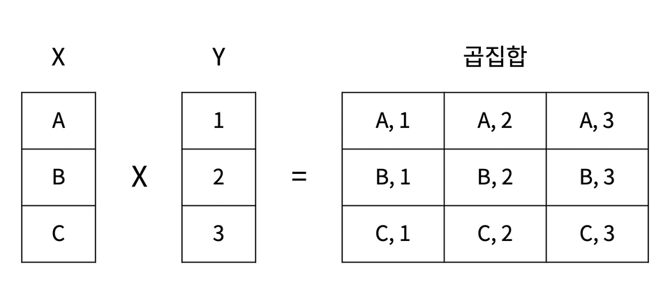

## 목차

---

## 31강 집합 연산

### union

-> union을 통하여 합집합을 처리할 수 있다.

```sql
select * from sample71_a
union
select * from sample71_b;
```
- 두 개의 select 명령을 하나의 명령으로 합치는 만큼 세미콜론을 나중에 붙인다.
- union을 처리하면 중복된 데이터를 삭제하며 union all은 중복된 데이터도 같이 보여준다.

> union을 사용하면 order by를 지정해 정렬할 수 없다.

```sql
select a  from sample71_a
         union
select b  from sample71_b order by b;

------------------------------------------------ 

select a  from sample71_a order by a
union
select b  from sample71_b;
```

- order by로 정렬할 수 없는건 아니다. 합집합의 결과를 정렬하므로 마지막 select 명령에 order by를 지정해야 한다는 의미이다.
위에 두 쿼리를 살펴보면 오류가 나온다. 

>union으로 select 명령을 연결하는 경우, 가장 마지막 select 명령에 대해서만 order by구를 지정할 수 있다.
order by 구에 지정하는 열은 별명을 붙여 이름을 일치시킨다.

```sql
select a as c from sample71_a
union
select b as c from sample71_b order by c;
```

### union all

- union은 합집합을 구하는 것이므로 두 개의 집합에서 겹치는 부분은 공통 요소가 된다.
- 이들은 합집합 하면 하나만 존재한다. 두 명령의 실행 결과에 ```distinct```를 걸어 중복을 제거한 것과 비슷하다.

- distinct나 all로 중복제거 여부를 지정할 수 있다는 점은 똑같지만 union의 기본동작은 all 이 아닌 distinct라는 점이 다르다.
- 또한 union distinct라는 문법은 허용하지 않는다.
```sql
select a from sample71_a
union all 
select b  from sample71_b;
```


## 32강 테이블 결합

- 곱집합과 교차결합

- 두 개의 집합을 곱하는 연산 방법으로 직접합, 카티전곱이라고 불린다.



- 교차결합 (cross join)

```sql
select * from table1 , table2;
```

> union과 교차결합의 차이
- union은 세로방향으로 더해지고  교차집합은 가로방향으로 더해진다.
